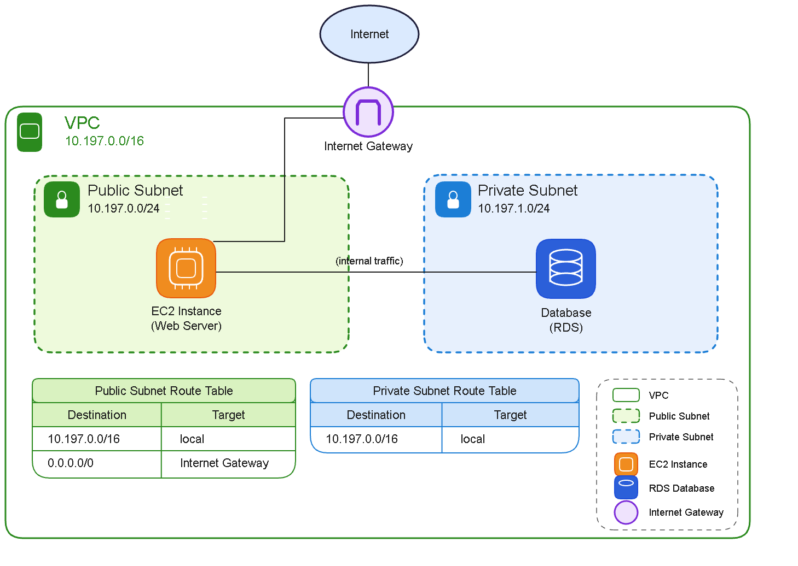

# Assignment 2 Submission

<!--
How to use this template:

1. Copy this file to submissions/assignment-2/<your-github-username>/submission.md
2. Replace every answer placeholder with your own answer. Delete the angle brackets too.
3. Save your four images in the same folder, with the exact file names below.
4. Do not write your full name or your student number in this file.
-->

## About me

- GitHub username: jhonemarss
- Section: IV-DCSAD
- IAM user name that I signed in with: NO ACCESS — I have not been able to sign in to the class AWS account.
- X: 197

---

## Part A. Explore

### A1. The VPC

Default VPC IPv4 CIDR:

NO ACCESS — I have not received the class AWS sign-in link or lab credentials, so I could not inspect the VPC.

Number of addresses in that CIDR:

NO ACCESS — I have not received the class AWS sign-in link or lab credentials, so I could not inspect the VPC.

### A2. The subnets

Availability Zone	IPv4 CIDR
NO ACCESS — see access error	NO ACCESS
NO ACCESS — see access error	NO ACCESS
NO ACCESS — see access error	NO ACCESS

Screenshot 1. Save it as `screenshot-1-subnets.png` in your folder. The image line below shows it.

### A3. Available addresses

Available IPv4 addresses in each subnet:

<answer>

Why is the number lower than 4,096?

<answer>

What uses the missing address in the subnet with the lowest number?

<answer>

### A4. The route table

| Destination | Target |
| --- | --- |
| <answer> | <answer> |
| <answer> | <answer> |

Screenshot 2. Save it as `screenshot-2-routes.png` in your folder. The image line below shows it.

### A5. Public or private

Are the default subnets public or private? Which route proves it?

<answer>

### A6. The internet gateway

State of the internet gateway:

<answer>

What happens to the default subnets if the gateway is detached?

<answer>

### A7. NAT gateways

Number of NAT gateways:

<answer>

Can a server in a new private subnet download updates? Why?

<answer>

### A8. The network ACL

| Rule number | Source | Allow or Deny |
| --- | --- | --- |
| <answer> | <answer> | <answer> |
| <answer> | <answer> | <answer> |

How is a network ACL different from a security group?

<answer>

Screenshot 3. Save it as `screenshot-3-network-acl.png` in your folder. The image line below shows it.

### A9. The default security group

Inbound rule (type and source):

<answer>

Which resources can send traffic to an instance that uses it?

<answer>

---

## Part B. Prepare

### B1. Plan two subnets

Public subnet CIDR: 10.197.0.0/24

Private subnet CIDR: 10.197.1.0/24

### B2. Route tables

Route table of the public subnet:

| Destination | Target |
| --- | --- |
| 10.197.0.0/16 | local |
| 0.0.0.0/0 | Internet gateway|

Route table of the private subnet:

| Destination | Target |
| --- | --- |
| 10.197.0.0/16 | local |

### B3. My VPC diagram

Tool used (Excalidraw, draw.io, Lucidchart, or paper):

Excalidraw

Save your diagram as `vpc-diagram.png` in your folder. The image line below shows it.

### B4. Predict a change

Can you still open the web page from your laptop? Why?

No, if the instance loses its default route to the internet gateway, it loses that internet path. A public IP alone is not enough.

Can the instance still reach another instance in the VPC? Why?

Yes, if the local route remains and the security rules allow the traffic.

### B5. Place a database

Which subnet gets the database? Why?

I would place the database in the private subnet (10.197.1.0/24) to avoid direct public internet access and restrict access to the application resources that need it.

### B6. My question about VPCs

What is your question, and what made you think of it?

Can two VPCs in the same AWS account communicate with each other, and do they need different CIDR ranges? I thought of this question because I want to understand how AWS connects separate VPCs without creating IP address conflicts.